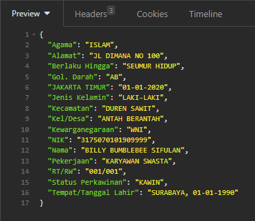
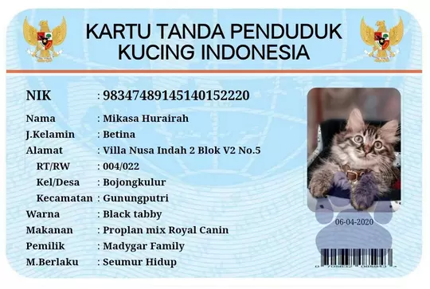
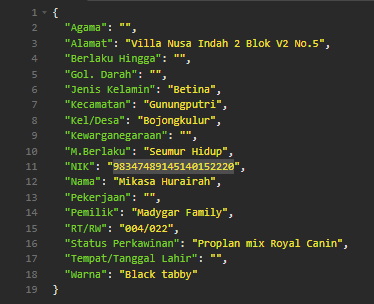

# AWS Textract based KTP Extractor

Attempt | Result
--- | ---
 | 
https://github.com/bukalapak/KTPextractor/issues/2 | ✅ Fixed
 | 
Your Blurry made-up KTP | ?

## How to Use

1. Make sure you have an AWS Account with Textract Feature activated
2. a Go compiler, [download here](https://go.dev/dl/)
3. execute `go run .` (for local testing)
4. curl -F "image=@ktp-picture.jpg" http://localhost:8080/analyze

## We Need Your Help!

the ktp.go file needs some tuning!
